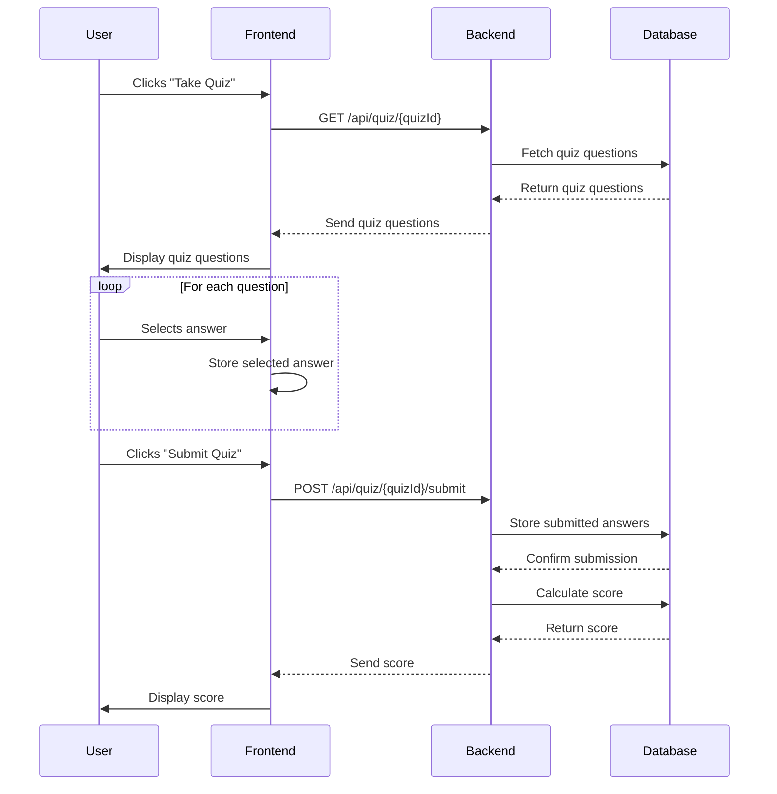

```mermaid
sequenceDiagram
    participant User
    participant Frontend
    participant Backend
    participant Database

    User->>Frontend: Clicks "Take Quiz"
    Frontend->>Backend: GET /api/quiz/{quizId}
    Backend->>Database: Fetch quiz questions
    Database-->>Backend: Return quiz questions
    Backend-->>Frontend: Send quiz questions
    Frontend->>User: Display quiz questions

    loop For each question
        User->>Frontend: Selects answer
        Frontend->>Frontend: Store selected answer
    end

    User->>Frontend: Clicks "Submit Quiz"
    Frontend->>Backend: POST /api/quiz/{quizId}/submit
    Backend->>Database: Store submitted answers
    Database-->>Backend: Confirm submission
    Backend->>Database: Calculate score
    Database-->>Backend: Return score
    Backend-->>Frontend: Send score
    Frontend->>User: Display score
```
